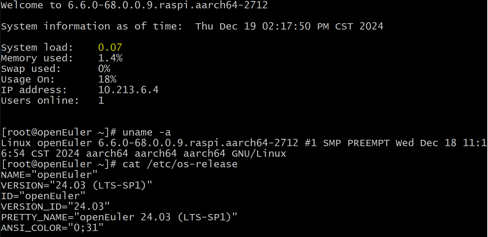

<!-- TOC -->

- [介绍](#介绍)
- [实验环境](#实验环境)
- [安装依赖软件](#安装依赖软件)
- [编译](#编译)
    - [设置环境变量](#设置环境变量)
    - [内核编译](#内核编译)
- [验证内核可用性](#验证内核可用性)

<!-- /TOC -->

# 介绍

> **说明：**   
>如需根据自身需求定制内核，可参考本文档。

目前 openEuler 树莓派版本只支持 AArch64 架构。

编译内核时，除了使用 AArch64 架构的运行环境，也可以采用交叉编译的方式。这里，我们以 ubuntu16.04 x86_64 的服务器上编译内核为例，介绍交叉编译的过程。

# 实验环境

- 操作系统：ubuntu16.04
- 架构：x86_64

# 安装依赖软件

`apt-get install build-essential gcc-aarch64-linux-gnu binutils-aarch64-linux-gnu bc libssl-dev -y`

# 编译

## 设置环境变量

`export ARCH=arm64`

`export CROSS_COMPILE=aarch64-linux-gnu-`

## 内核编译

具体编译过程请参考文档 [内核编译](./内核编译.md#内核编译)。

# 验证内核可用性

使用一个之前刷好 openEuler 树莓派镜像的 SD 卡，直接插到 Linux 主机上，SD 会默认挂载其 `boot` 分区和 `root` 分区。这里其挂载路径分别表示为 `${boot}` 和 `${rootfs}`，将上面编译好的内核放置到SD卡对应分区。

内核更新过程请参考文档 [内核更新](./内核编译.md#内核更新)。

之后，参考 [树莓派使用](./树莓派使用.md) 使用该 SD 卡启用树莓派，验证功能：

